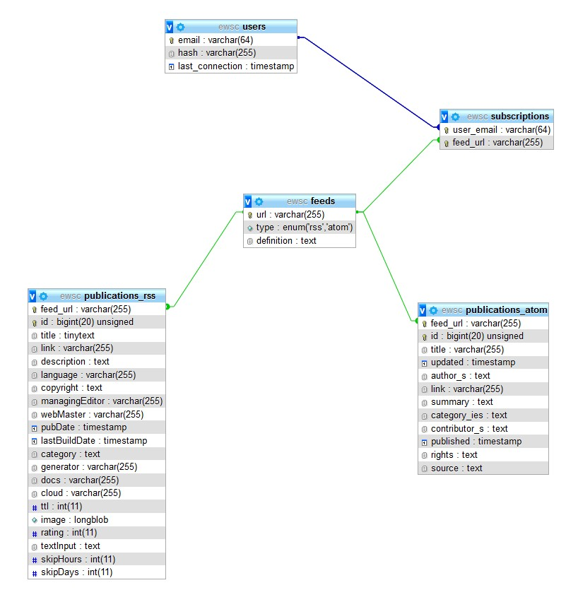

# Enterprise Web Systems Coursework

## 3-Tier RSS Feed Tool

For the coursework component of this module you are going to develop a 3-tier web application that implements an RSS feed tool. It will support multiple users, multiple RSS feeds, and when a user logs in to the system it will present to the user a set of articles drawn from the collated feeds a user has registered within the system. For this you will code:

1. A presentation layer, making use of HTML, Javascript and CSS
2. An application layer, making use of PHP
3. A data layer, making use of mySQL or MongoDB

The application should be designed according to the MVC design pattern and communication between each separate subsystem should be handled via XML or JSON.

RSS is an XML based protocol by which blogs, news-sites and other web resources release their updates to interested parties. This means that people can choose whether to visit the site or make use of an external tool to track updated content. You can read about the RSS protocol here: https://en.wikipedia.org/wiki/RSS

Your system will need to implement the following key features:

* A login system, making use of appropriate security measures such as salting.
  * Users will be able to record a list of feeds in which they are interested, and this has to be stored separately for each user account.
* A web API that permits users to add, remove or modify the RSS feeds that are associated with their account.
  * It should also give a consolidated list of articles that have been released on all RSS feeds since the last login.
* The application needs to store user and RSS feed information. Caching of feeds across user accounts is not necessary but would be meritorious.
* A front-end that permits users to access the functionality of the API and browse through the new entries in their feeds.

The software you develop must adhere to the design guidelines discussed during the course of the module:

* Appropriate use of the MVC design pattern
* Adherence to PAD layers within the 3-tier architecture
* Proper decomposition of responsibilities into the appropriate tier elements
* Should be asynchronous at the front-end and implementation agnostic at the back-end

## Requirements

Apache HTTP server
PHP7 with PDO

## Routes

`
base = http://ewsc
	GET
		handler location
			index.php
		field
			ignored
		response
			200
	POST
		handler location
			sign.php
		field
			email, password, remember
		response
			200 = sign in
			201 = sign up
			401 = if email exists but password does not match

	ALL EXCEPT HEAD
		response
			405
`
`
user = base/{user} (first part of email)
	GET
		handler location
			load.php
		field
			feed (all(default) / page) + subscriptions
		response
			200
			400 = page in not a number
			401 = not connected or wrong user
			404 = page not found

	POST
		handler location
			subscribe.php
		field
			action, feed
		response
			200 = already subscribed OR deleted/does not exist
			201 = inserted
			400 = not an rss feed
			401 = not connected or wrong user
	
	ALL EXCEPT HEAD
		response
			405
`

## Database

### Design

### Creation script

[build script](data/ewsc.sql)

### Users

#### Read operations

name : ewsc_r

password : t9x.g}sTL|EF

##### Operations

data : `SELECT`

structure : `EXECUTE`

#### Read operations

name : ewsc_w

password : \IiT42_:@VUW

##### Operations

data : `INSERT`, `UPDATE`, `DELETE`

structure : `EXECUTE`

#### Sampleend-user

email : test@example.com

password : aA000000

## User interface

### FONTS

headers : https://fonts.google.com/specimen/Lobster

body : https://fonts.google.com/specimen/Comfortaa

brand : https://fonts.google.com/specimen/Srisakdi